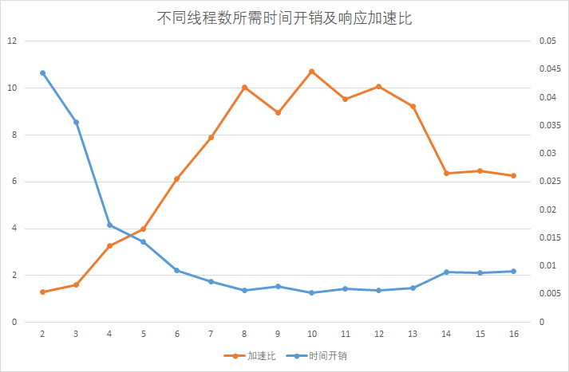
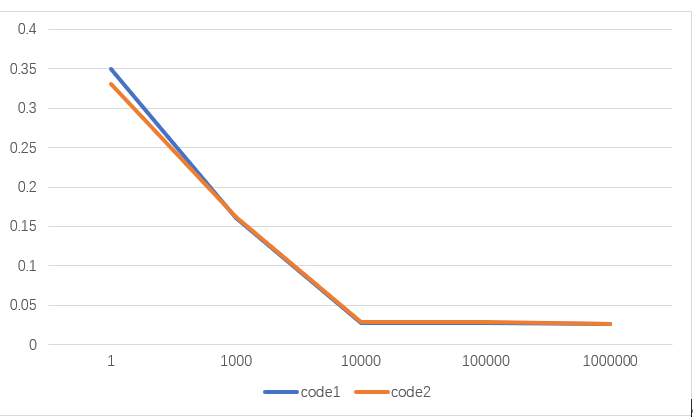
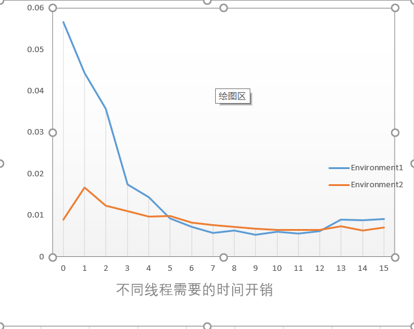

# Lab1 test report

## 1.实验概要

&emsp;&emsp;多线程编程是高性能编程的技术之一，实验1将针对数独求解问题比较多线程与单线程的性能差异、同一功能不同代码实现的性能差异以及多线程在不同硬件环境下的性能差异。

### 1.1 程序输入

&emsp;程序将在控制台接收用户多个输入，每个输入为一行字符串，该字符串是一个文件名，应为某一目录下的一个数独谜题文件，该文件包含多个数独谜题，每个数独谜题按固定格式存储在该文件中。

### 1.2 程序输出

&emsp;&emsp;实验中把数独的解按与输入相对应的顺序写入到一个文件中。

### 1.3 Sudoku算法

&emsp;&emsp;实验共提供了4中不同的Sudoku求解算法：BASIC,DANCE,MINA和MINAC。其中，DANCE算法速度最快，BASIC算法速度最慢。实验中选用的是最快的DANCE算法。

### 1.4 性能指标

实验以求解完多个输入文件里的所有数独题并把数独的解按顺序写入文件所需要的时间开销作为性
能指标。一般而言,可以用加速比直观地表示并行程序与串行程序之间的性能差异(加速比:串行执行
时间与并行执行时间的比率,是串行与并行执行时间之间一个具体的比较指标)。
为了精确地测量性能,时间开销均在数独求解进程 / 线程绑定 CPU 的某个核的条件下测得,这样保证
了该进程 / 线程不被调度到其他核中运行,但不保证该进程 / 线程独占某个核。更精确的测量方法可以先
把 CPU 的某个核隔离,而后再绑定在某个进程 / 线程上,这样该 CPU 核心不会运行其他的用戶程序。当
CPU 资源充足时( CPU 核心数足够多,当前正在运行的进程 / 线程足够少),是否把核隔离并没有多大影
响,因为操作系统的调度策略不会频繁的对线程 / 进程进行无谓的调度。

### 1.5 实验环境

实验中共有 2 个不同的实验环境: ENV1 和 ENV2 。
ENV1: CPU 型号为Intel(R) Core(TM) i5-8250U CPU @ 1.60GHz，1个CPU, 8个内核
ENV2: CPU 型号为Intel(R) Core(TM) i7-8750U CPU @ 2.20GHz, 2个CPU， 每个CPU6个内核，共12个内核。

如无特别说明，默认使用ENV1。

### 1.6 代码实现版本

实验中共使用两份不同的代码: Code1 和 Code2 。

**Code1**: 原生的数独求解代码,即本实验中所提供的代码,只能以单线程模式运行。

**Code2**: 为适应多线程而在 Code1 上进行了一系列的修改和增添而成。线程2使用了线程池，在code2中，主要使用了c++11来编写线程池类，使用了hardware_concurrency()来获取内核数，以此数作为开线程的数量，主线程负责读写数据，和求解一少部分数独问题，线程池求解大部分问题，因是获取了内核数，开辟的线程数正好使用，所以测量时不绑核。

## 2.性能测试

程序的性能会受到诸多因素的影响,其中包括软件层面的因素和硬件层面的因素。本节将分析比较
多线程程序与单线程程序的性能差异、同一功能不同代码实现的性能差异,以及同一个程序在不同硬件
环境下的性能差异。

### 2.1多线程与单线程性能比较

单线程程序只能利用 1 个 CPU 核心,而多线程程序能使 CPU 的多个核心并行运作,因此,多线程能够
充分发挥多核 CPU 的优势。在一定范围内,加速比会随着线程数的增加而增⻓,即时间开销越少、效率
越高。当线程数超过 CPU 核心数时,性能会有所下降。
为了比较多线程与单线程性能差异,实验将提供 1 个具有 10000 个数独题的文件,而后分别使用单个 sudoku_solve 线程和 n 个 sudoku_solve 线程分别对该文件内的所有数独题进行求解,并把解写入到文件中,测量这一部分所需要的时间开销并计算加速比。(这份代码有个缺陷，是在所有数独题求解完了才进行输出，所以没把输出时间加入进去)

&emsp;&emsp;图2-1展示了不同线程数对性能造成的影响，其2条折线：**Consumed time**和**Speedup**分别表示随sodoku_solve线程数量的变化所需的时间开销和相应的加速比。从图2-1可以看出，当总线程数小于CPU总核心数时，随着线程数的增加，所需要的时间开销越小、加速比更高。从线程池里线程数为7开始，总线程数开始超过CPU物理核心数，线程开始被操作系统调度，调度会有一定的开销，所以性能会有所下降。

在实验中把大部分任务量都放入了线程池，考虑到主线程的空闲，给主线程分配了很少一部分任务量，可能没有绑核的原因(没找到c11绑核的函数)，当线程数大于CPU核数的时候，加速比有所下降，但下降不是很明显。

### 2.2不同代码实现性能比较

实验将使用 2 份不同的代码进行性能比较: Code1(实验提供的代码) 和 Code2(自己实现的代码)，两份代码都使用单线程 。实验提供 85个不同大小的文件,每个文件分别有数独题:1， 1000, 10000, 100000, 1000000。因为都是单线程，自己实现代码为了实现单线程，没开线程池，所以两份代码的时间开销几乎相同

### 2.3不同硬件环境性能比较

硬件环境如 CPU 主频(其它如物理 CPU 个数、物理核心数等)的不同,会导致同一个程序在不同的
硬件环境中有不同的表现。对单个 CPU 物理核心,其主频越高,运行速度越快。

实验将使用 Code2 分别在 ENV1 和 ENV2 中对具有 10000 个数独题的文件进行求
解,其中 线程数从 1 开始逐步增加,测量时间开销。

图 2-3 为 Code2 在不同的硬件环境 ENV1 和 ENV2 中分别调整不同的 线程数的测试结果。从图 2-3 可以看出,当线程数在 1 〜 4 时, ENV2 的时间花销略小于 ENV1 ,因为 ENV2 的CPU 主频为 2.6 GHZ ,略大于 ENV1 的主频 2.0 GHZ ,即对单个物理核心而言, ENV2 的运行速度比 ENV1快。当 线程数量在 5 〜 10 时, ENV2 的时间开销要略大于 ENV1 ,这是因为 ENV2 单个CPU只有 6 个物理核心,我猜测可能是线程在两个CPU之间来回调度，所以ENV2的时间开销略大（还有测量误差的原因）。但当线程数量大于8之后，ENV2的时间开销较小，因为ENV1总共只有8个核，而ENV2总共有12个核，所以ENV1的线程调度更多，时间开销自然更大。

